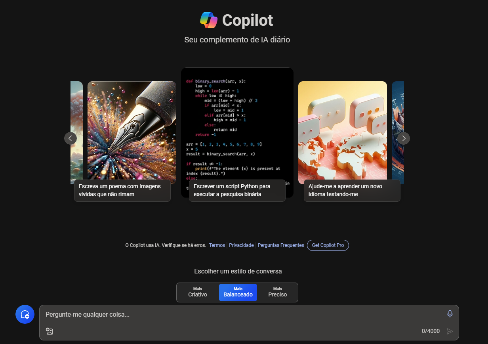
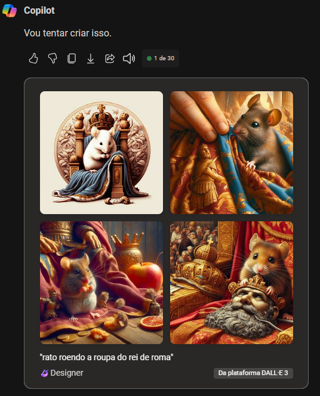

# Explore IA Generativa com Microsoft Copilot

O Microsoft Copilot, é um assistente de inteligência artificial projetado para ajudar os usuários fornecendo informações, respondendo perguntas e participando de conversas.

Aqui iremos explorar o uso de IA Generativa com o Microsoft Copilot presente no Microsoft Edge.

## Crie ou Logue sua conta Microsoft no Copilot

1 - Abra o [Microsoft Copilot](https://copilot.microsoft.com/).

2 - Alguns de seus recursos são:

- **Informações e Respostas:** Fornece informações e respostas para uma ampla variedade de tópicos com base no meu conhecimento interno e na minha capacidade de pesquisa na web.

- **Conversação:** Participa de conversas em vários idiomas, incluindo Português, Inglês, Espanhol, Francês, Alemão, entre outros.

 - **Conteúdo Criativo:** É capaz de gerar conteúdo criativo e inovador, como poemas, histórias, código, ensaios, músicas e muito mais.

- **Assistência de Redação:** Se solicitado, pode ajudar a escrever, reescrever, melhorar ou otimizar o conteúdo do usuário.

- **Compreensão de Imagens:** Tem a capacidade de entender imagens que o usuário carrega.

Isso e muitos outros serviços.

### Como usar?

1 - Escreva na entrada de texto uma requisição e em seguida aguarde a resposta.

2 - Eu inseri a seguinte entrada:

    Desenhe o rato roendo a roupa do rei de roma.

3 - Fui respondido com as seguites saídas:

### Conclusão

E com isso eu concluo o laboratório de Exploração de IA Generativa.